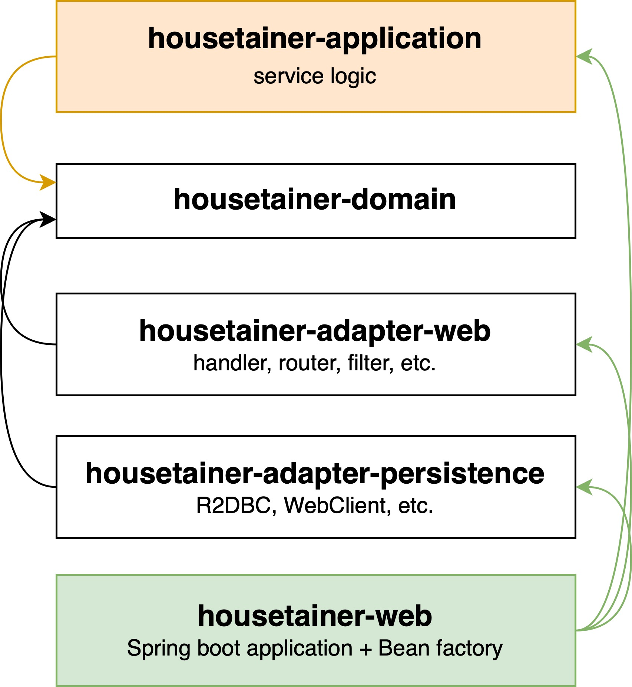

# housetainer

---

## Architecture
> Clean Architecture

.jpg)

### Module Hierarchy

---

## Technologies & Frameworks
* Java 11
* Kotlin + Spring Webflux (with coroutine)
* Groovy + Spock (for testing)
* R2DBC + MySQL

---

## Deployment
* Github Action
* AWS Code Deploy
* S3

---

## How to implement a new API

1. `housetainer-model`에 request, response model(`.proto`) 추가

 

2. `housetainer-domain` 모듈에 아래 항목들 추가
* Entity (data class)
    * application domain model (User, Device, Schedule 등)
        * application layer에서 사용되는 도메인 객체
* Model (data class)
    * 각 layer간 통신(호출)을 위한 모델 (layer 간의 request and response 모델)
    * 단 DTO 모델 (`housetainer-adapter-persistence` 모듈에서 외부 서비스를 호출할때 사용하는 모델)은 `housetainer-adapter-persistence` 모듈이 독립적으로 들고 있어야함
* Use case
  * `housetainer-web-adapter`에서 호출하는 use case interface (`A`) - 비즈니스 로직이 담길 port
* Persistence
  * `housetainer-adapter-persistence`과 소통할 repository interface (`B`) - 실 data 호출 로직이 담길 port
  * 네이밍 룰은 `CQRS` 패턴을 따라 `command`와 `query`를 사용

 

3. `housetainer-application` 모듈에 use case interface (`A`)를 구현 (`C`)
* application logic 검증을 위한 unit 테스트 추가 **(use case 및 repository interface는 mocking)**

 

4. `housetainer-adapter-persistence` 모듈에 repository interface (`B`)를 구현
* 절대로 **비즈니스 로직이 담기면 안됨.** (함수의 역할은 최대한 간소하게)
  * 이 모듈에서 비즈니스 로직이 필요할 것 같다는 생각이 든다면 100% application layer에서 구현할 수 있음
* 실 data 호출 구현에 대한 integration 테스트 작성 **(대부분의 경우 mocking이 필요하지 않고 stubbing만 사용)**

 

5. `housetainer-web` 모듈에 use case 구현체(`C`)를 `Bean`으로 생성

 

6. `housetainer-web-adapter` 모듈에서 추가하고자 하는 api의 `router` 및 `handler` 추가 
* handler에서 use case interface(`A`)를 호출하도록 구현
* header 및 request에 대한 validation 수행
* 어떠한 비즈니스 로직도 포함되서는 안됨

 

7. `housetainer-web` 모듈에 system test 작성
* 해당 API에 대해 정상적인 api 호출 여부, 헤더 및 request의 validation에 대한 integration 테스트 추가
* 실제 API 호출을 통해 전체 로직을 테스트하는 것이기 때문에 정상적이라면 **mocking이 절대 필요하지 않음** (stubbing만으로 테스트 수행)
